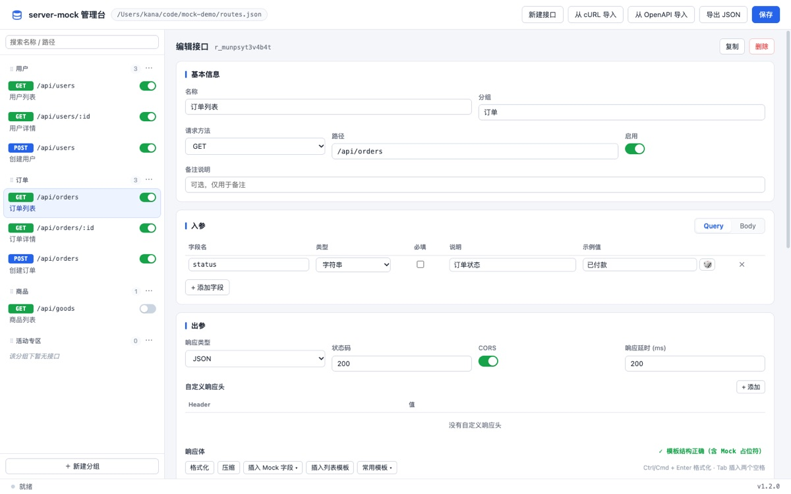
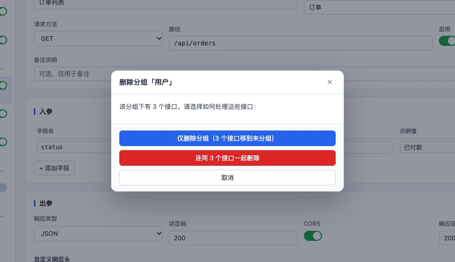

# server-mock

启动一个 Web 服务器并 mock 数据，写法参考 Express，另外内置一个**可视化管理台**——不写代码也能配出接口。

## 安装

```bash
npm install -g server-mock
# 或者从本仓库安装
npm install -g .
```

## 快速开始

```bash
mkdir demo && cd demo
mock init      # 生成示例 router.js / index.html / routes.json
mock web       # 启动服务并打开管理台
```

打开 <http://localhost:8080/index.html> 就能在页面上增删改接口，保存后立即生效，不用重启。直接访问 <http://localhost:8080> 会自动跳到这个页面。

也可以完全不用管理台，直接跑 `mock start`，它会读取同一份 `routes.json`。

## 命令

| 命令 | 作用 |
| --- | --- |
| `mock web` | 启动服务 + 可视化管理台（默认入口 `/index.html`） |
| `mock start` | 只启动服务（也会加载 `routes.json`） |
| `mock open` | 启动服务并自动打开目录里的 html |
| `mock init` | 生成示例文件：`router.js`、`index.html`、`routes.json` |

通用参数：

```bash
mock web --port 3000              # 端口，默认 8080
mock web --public public          # 静态目录，默认当前目录
mock web --views views            # 模板目录，默认当前目录
mock web --tpl ejs                # 模板引擎，默认 ejs
mock web --config mock/routes.json  # 接口配置文件，默认当前目录的 routes.json
```

## 可视化管理台

`mock web` 之后访问 `http://localhost:<端口>/index.html`。只输入 `http://localhost:<端口>` 会自动 302 到这个页面。

> 注意：`web` 模式下根路径的 `index.html`、`app.js`、`style.css` 归管理台使用，项目里同名的文件会被遮住。`start` 模式不挂管理台，不受影响。



| 能力 | 说明 |
| --- | --- |
| 接口增删改查 | 左侧按分组列出接口，可搜索、可一键停用、可复制、可删除 |
| 分组管理 | 新建分组、重命名（该分组下接口一起改名）、删除分组（可选「接口移到未分组」或「连接口一起删除」）、拖动排序 |
| 入参表单 | Query / Body 字段表格：字段名、类型、必填、说明、示例值；`{{@xx}}` 路径参数自动识别 |
| 出参配置 | 响应类型（JSON / 纯文本 / HTML）、状态码、CORS 开关、响应延时、自定义响应头 |
| JSON 编辑器 | 语法高亮、实时校验（带行号）、格式化 / 压缩、Tab 缩进、滚动同步 |
| 随机 Mock 数据 | 「插入 Mock 字段」按分组列出所有占位符，点一下插到光标处；每次请求都会重新生成随机值 |
| 常用响应模板 | 标准成功 / 列表分页 / 对象详情 / 业务失败 / 登录成功 / 回显请求参数 / 空列表 |
| 从 cURL 导入 | 粘贴浏览器「Copy as cURL」，自动解析 method、路径、query、body 并生成回显响应 |
| 从 OpenAPI 导入 | 粘贴 OpenAPI 3 / Swagger 2 定义（JSON 或 YAML），按 schema 批量生成接口和随机数据结构 |
| 接口自测 | 在页面里真实发起请求，看状态码、耗时、响应头和响应体；URL 与参数按入参定义自动预填 |
| 即时生效 | 保存后服务端热更新路由，无需重启；外部直接编辑 `routes.json` 也会自动生效 |
| 导入导出 | 一键导出 `routes.json` |

删除分组时会让用户明确选择接口去向，避免误删：



界面完全离线可用：零构建、无 CDN、无外部字体和图标。

## routes.json

管理台的所有配置都存在这个文件里，默认在当前目录，可用 `--config` 指定。

```json
{
  "version": 1,
  "groups": ["用户", "订单"],
  "routes": [
    {
      "id": "r_lx3k2a",
      "name": "用户列表",
      "group": "用户",
      "desc": "分页列表",
      "enabled": true,
      "method": "GET",
      "path": "/api/users",
      "status": 200,
      "delay": 0,
      "cors": true,
      "headers": [{ "key": "X-Token", "value": "abc" }],
      "query": [
        { "key": "page", "type": "number", "required": false, "desc": "页码", "example": "1" }
      ],
      "body": [
        { "key": "name", "type": "name", "required": true, "desc": "姓名", "example": "张三" }
      ],
      "responseType": "json",
      "response": "{\n  \"code\": 0,\n  \"list\": [\n{{@repeat(3)}}    { \"id\": \"{{@id}}\" }\n{{/repeat}}  ]\n}"
    }
  ]
}
```

| 字段 | 说明 |
| --- | --- |
| `method` | `GET` `POST` `PUT` `DELETE` `PATCH` `HEAD` `OPTIONS` `ALL` |
| `path` | Express 风格，支持 `:id` 路径参数；不能以 `/__admin` 开头（管理台占用） |
| `status` | 100~599 |
| `delay` | 响应延时，毫秒 |
| `cors` | 打开后自动补 `Access-Control-Allow-*`，并处理 `OPTIONS` 预检 |
| `responseType` | `json` / `text` / `html` |
| `response` | 响应体模板，支持下面的占位符语法，**每个请求都会重新渲染** |
| `query` / `body` | 只是入参描述，用于文档和自测面板预填，不做强制校验 |

顶层的 `groups` 是分组列表，决定侧边栏里分组的名字和顺序。它可以是空的，也可以包含还没有接口的分组；接口上的 `group` 只要写了新名字，会自动登记进来。老文件里没有 `groups` 字段也能正常用——分组会从接口的 `group` 里推导出来。

`routes.json` 也可以直接写成顶层数组。

## Mock 数据模板

写在 `response` 里，每次请求都会重新生成。

### 文本

| 写法 | 说明 |
| --- | --- |
| `{{@cname}}` | 随机中文姓名 |
| `{{@firstname}}` | 随机中文姓氏 |
| `{{@ename}}` | 随机英文姓名 |
| `{{@word}}` | 随机词语 |
| `{{@words(3)}}` | 3 个随机词语（空格分隔） |
| `{{@sentence}}` | 随机一句话 |
| `{{@paragraph}}` | 随机一段话 |
| `{{@title}}` | 随机标题 |
| `{{@company}}` | 随机公司名 |
| `{{@job}}` | 随机职位 |
| `{{@university}}` | 随机大学 |
| `{{@city}}` | 随机城市 |
| `{{@province}}` | 随机省份 |
| `{{@address}}` | 随机详细地址 |

### 数字

| 写法 | 说明 |
| --- | --- |
| `{{@int(1,100)}}` | 区间内随机整数 |
| `{{@float(1,100,2)}}` | 区间内随机小数，保留 2 位 |
| `{{@price(1,999)}}` | 随机价格（两位小数） |
| `{{@id}}` | 自增 ID，从 1 开始，每次请求递增；`{{@id(1000)}}` 可指定起点 |

### 其他

| 写法 | 说明 |
| --- | --- |
| `{{@bool}}` | 随机 `true` / `false` |
| `{{@pick(待付款,已付款,已发货)}}` | 从候选值里随机取一个 |

### 时间

| 写法 | 说明 |
| --- | --- |
| `{{@date}}` | 今天日期 `YYYY-MM-DD` |
| `{{@time}}` | 当前时间 `HH:mm:ss` |
| `{{@datetime}}` | 当前日期时间 |
| `{{@timestamp}}` | 当前毫秒时间戳 |
| `{{@dateOffset(-3)}}` | 相对今天偏移 n 天的日期 |
| `{{@datetimeOffset(7)}}` | 相对当前时间偏移 n 天的日期时间 |

### 网络 / 标识

| 写法 | 说明 |
| --- | --- |
| `{{@uuid}}` | 随机 UUID |
| `{{@phone}}` | 随机手机号 |
| `{{@email}}` | 随机邮箱 |
| `{{@url}}` | 随机 URL |
| `{{@image(200x200)}}` | 随机图片地址 |
| `{{@ip}}` | 随机 IP |
| `{{@color}}` | 随机十六进制颜色 |
| `{{@token}}` | 32 位随机 token |

### 输入回显

| 写法 | 说明 |
| --- | --- |
| `{{@query(id)}}` | 回显 URL 查询参数 |
| `{{@body(name)}}` | 回显请求体字段，支持 `{{@body(user.name)}}` 取嵌套 |
| `{{@params(id)}}` | 回显路径参数 |
| `{{@header(token)}}` | 回显请求头 |

### 列表重复

```json
{
  "list": [
{{@repeat(3)}}    { "id": "{{@id}}", "name": "{{@cname}}" }
{{/repeat}}  ]
}
```

* `{{@repeat(3)}}` 重复 3 份，`{{@repeat(2-5)}}` 随机 2~5 份，支持嵌套。
* 重复出来的多个 JSON 值之间**不必写逗号**，服务端会自动补上，也会忽略多余的尾逗号，所以不用纠结最后一个元素后面要不要逗号。

### 类型自动匹配

占满整个 JSON 字符串的数值类占位符会自动去掉引号：

```json
{ "age": "{{@int(18,60)}}", "vip": "{{@bool}}" }
```

实际返回 `{ "age": 42, "vip": true }`（数字和布尔，而不是字符串）。写在文字中间则保持字符串，例如 `"msg": "你好 {{@cname}}"`。

## 兼容手写 router.js

老的用法完全保留：当前目录存在 `router.js` 时照旧加载（`router` 就是 Express app）。

```javascript
router.get('/hello', function (req, res) {
  res.send({ status: 0, msg: 'hello hunger valley' })
})

router.use('/hi', (req, res) => {
  res.header('Access-Control-Allow-Origin', '*')
  res.send('world')
})
```

两者可以共存：**先匹配 `routes.json`，没命中的再交给 `router.js`**。更多路由写法见 <http://expressjs.com/en/guide/routing.html>。

> 注意：`router.js` 里只写路由即可，不要自己套 `function setRouter(app){...}` 外壳。检测到已包装会打印 Warning 并按原样使用。

## 管理台 API

管理台前端用的就是这些接口，也可以直接调：

| 方法与路径 | 说明 |
| --- | --- |
| `GET /__admin/api/meta` | 占位符、字段类型、响应模板、方法列表、配置路径 |
| `GET /__admin/api/routes` | 全部接口配置 |
| `POST /__admin/api/routes` | 新建 |
| `PUT /__admin/api/routes/:id` | 更新 |
| `DELETE /__admin/api/routes/:id` | 删除 |
| `POST /__admin/api/routes/:id/duplicate` | 复制 |
| `GET /__admin/api/groups` | 分组列表（含每个分组的接口数） |
| `POST /__admin/api/groups` | 新建分组，body `{ name }` |
| `PUT /__admin/api/groups/:name` | 重命名分组，body `{ name }`，该分组下接口一起改名 |
| `DELETE /__admin/api/groups/:name` | 删除分组；默认把接口移到未分组，加 `?routes=delete` 则连接口一起删 |
| `POST /__admin/api/groups/reorder` | 调整分组顺序，body `{ names: [...] }`，只传部分分组也可以 |
| `POST /__admin/api/preview` | 渲染一次响应体，返回 warnings 和 JSON 校验结果 |
| `POST /__admin/api/import/curl` | 解析 cURL |
| `POST /__admin/api/import/openapi` | 解析 OpenAPI / Swagger |
| `POST /__admin/api/import/routes` | 批量落库 |
| `GET /__admin/api/export` | 导出 routes.json |

统一返回 `{ ok: true, ... }` 或 `{ ok: false, error: "..." }`。

## 开发与测试

```bash
npm test
```

74 个用例，覆盖模板引擎与 JSON 容错、cURL / OpenAPI 导入、配置存储与热更新、分组管理、管理台 API、以及 CLI 端到端（`init` / `web` / `start` / 端口占用 / 帮助信息）。

## 目录结构

```
bin/server            CLI 入口（yargs 17）
lib/command.js        start / open / web / init 命令实现
lib/routes-store.js   routes.json 读写、校验、文件监听
lib/mock-engine.js    模板渲染与随机数据生成
lib/mock-runtime.js   把配置编译成 Express 路由，支持热更新
lib/importers.js      cURL / OpenAPI 解析
lib/admin.js          管理台后端 API
lib/web/              管理台前端（零构建：index.html + app.js + style.css）
sample/               mock init 用的示例文件
test/                 node:test 测试
```

## License

ISC
