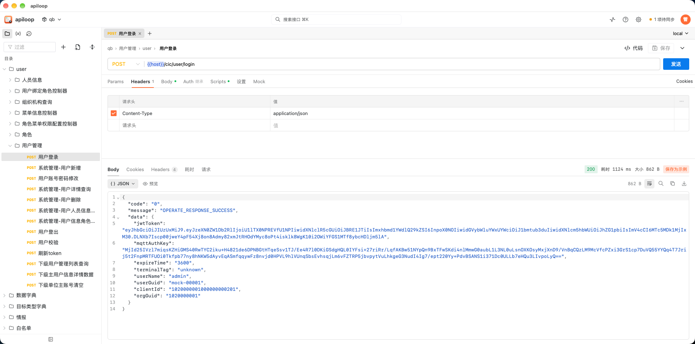
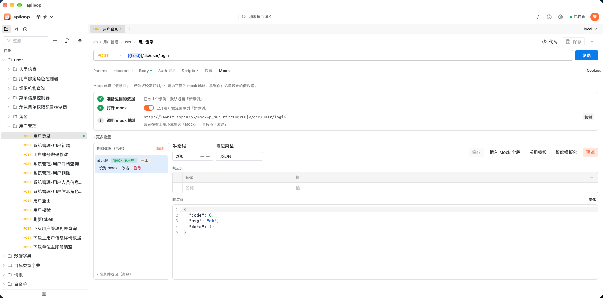
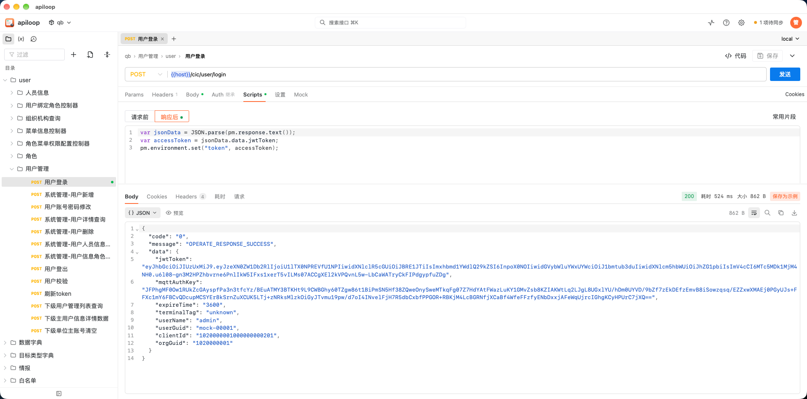

# apiloop

**团队用的接口调试工具：请求在自己电脑上发，数据在团队里同步，调通的接口直接变成 Mock。**

- **桌面客户端（Mac / Windows）**：请求从你自己的电脑发出，内网、本机的地址都能调；
  数据先存在本机，不登录也能用。
- **云端服务**：登录后项目、接口、环境自动同步，同事之间共享；没网时改动暂存在本机，
  联网后自动补上。云端同时提供 Mock 服务、用户管理和客户端安装包下载。
- **网页版**：直接打开云端地址也能用（请求从服务器发出）。

## 截图



| Mock：响应存成示例，直接当 Mock 返回 | 脚本与断言：请求前 / 响应后两段脚本 |
| --- | --- |
|  |  |

## 功能

| 模块 | 能做什么 |
| --- | --- |
| 请求调试 | HTTP 各种方法、Params / Headers / Body（JSON、表单、文件、GraphQL）、鉴权、Cookie 自动管理、代理、SSE 流式响应、WebSocket 调试 |
| 变量与环境 | 项目、目录、环境三层变量，同名按「项目 → 目录 → 环境」覆盖；内置 `{{$guid}}`、`{{$timestamp}}` 等动态变量 |
| 脚本 | 「请求前 / 响应后」两段 JavaScript，`pm.*` 写法：存取变量、改请求头、断言、脚本里再发请求、可视化 |
| 响应查看 | JSON 高亮与格式化、预览、搜索、下载、Cookies、测试结果、控制台、耗时、可视化 |
| Mock | 把响应存成示例就能当 Mock 返回；随机数据模板（姓名、手机号、列表重复…）；按条件返回不同示例；Mock 日志 |
| 内置 Mock 环境 | 环境里选「Mock」，`{{host}}` 就是这个项目的 Mock 地址；变量可改、可还原默认值 |
| 导入导出 | 集合 / 环境的 JSON 文件、cURL、OpenAPI / Swagger（地址、文件或粘贴）、HAR；一键复制为 cURL |
| 团队 | 账号注册（管理员审核后才能登录）、项目成员与角色（owner / editor / viewer）、冲突处理 |
| 客户端更新 | 云端有新版本时提示，点一下自动下载安装 |

用法说明（变量怎么写、脚本 API、用例、Mock 函数表）在应用里：顶栏的 **「?」帮助**。

## 部署云端

需要 Docker（带 Compose）。数据放在项目目录下的 `./data`。

```bash
cp .env.example .env        # 改对外端口、指定 admin 初始密码（可选）
./deploy.sh up --cn         # 构建并后台启动；--cn 用国内 npm 镜像
./deploy.sh logs            # 没设 ADMIN_PASSWORD 时，admin 的随机密码在日志里（搜「初始密码」）
```

打开 `http://服务器:8765`（端口在 `.env` 的 `PORT` 里改，容器内固定 8080），用 `admin` 登录后立刻改密码。

| 命令 | 作用 |
| --- | --- |
| `./deploy.sh up [--cn]` | 构建并启动（更新代码后也用它：`git pull && ./deploy.sh up --cn`） |
| `./deploy.sh logs` / `restart` / `stop` / `status` | 日志 / 重启 / 停止 / 状态 |
| `./deploy.sh user list` | 用户命令：`user add alice`、`user reset-password admin` |

**数据（`./data`）**

| 路径 | 内容 |
| --- | --- |
| `data/data.db`（及 `-wal`、`-shm`） | SQLite 数据库：用户、项目、接口、示例、环境、历史 |
| `data/files/` | 上传的文件（发送表单文件、二进制请求体用） |
| `data/downloads/` | 客户端安装包，见下面「发布客户端」 |

- 升级镜像不丢数据，启动时自动迁移数据库结构。
- 备份：先 `./deploy.sh stop`，再打包整个 `data/`，然后重新启动（运行中只复制 `data.db` 会不完整）。
- 容器以 uid 1000 运行，`./data` 要让 uid 1000 能写；`deploy.sh` 会先建好目录。
- Mock 接口不需要登录，管理台需要登录。

## 发布客户端

客户端安装包在 **Mac 上打**（Windows 包也是在 Mac 上交叉编译），云端地址打包时写进安装包：

```bash
# Mac：Apple 芯片 + Intel 两个 .pkg
APILOOP_CLOUD_URL=http://leonaz.top:8765 bash agent-installer/mac/build-all.sh

# Windows：.exe（需要本机装好 dotnet SDK）
APILOOP_CLOUD_URL=http://leonaz.top:8765 bash agent-installer/windows/build.sh
```

产物在 `agent-installer/dist/`：

```
apiloop-gateway-<版本>-arm64.pkg      Mac（Apple 芯片）
apiloop-gateway-<版本>-x64.pkg        Mac（Intel）
apiloop-gateway-<版本>-win-x64.exe    Windows 10 / 11
```

上传到服务器的 `data/downloads/`，并让容器能读：

```bash
scp agent-installer/dist/apiloop-gateway-<版本>-* 服务器:/部署目录/data/downloads/
ssh 服务器 'chmod 644 /部署目录/data/downloads/*'
```

放进去即生效，不用重启。同一个平台放了多个版本时只提供最新的。文件名必须是上面的格式。

**推荐顺序：** 先上传新安装包，再在服务器上 `git pull && ./deploy.sh up --cn` 更新云端。
云端版本更新后，已安装的客户端会提示「有新版本」，点一下自动下载安装。

**安装说明（给同事）：** 打开网页版，点顶栏右侧的「云端发送」，在弹出的窗口里下载对应系统的安装包。安装包没有签名：

- Mac：第一次打开被拦时，到「系统设置 → 隐私与安全性」点「仍要打开」；
- Windows：出现「Windows 已保护你的电脑」时，点「更多信息 → 仍要运行」。装在当前用户目录，不需要管理员权限。

## 开发

要求 **Node 22.13 及以上**（用内置的 `node:sqlite`，不需要装数据库）。

```bash
npm install
npm run dev:web      # 前端开发服务器（Vite 热更新，接口代理到 127.0.0.1:8080）
npm run build:web    # 构建前端到 lib/web
npm test             # 跑测试
```

本地起服务：

```bash
node bin/server web --port 8080                           # 云端（管理台 + Mock）
node bin/server gateway --cloud=http://127.0.0.1:8080     # 客户端里跑的本机网关（127.0.0.1:47321）
```

- **改了 `web/` 下的前端，要 `npm run build:web` 并把 `lib/web` 一起提交** —— 镜像和安装包都直接用仓库里的构建产物。
- 版本号在 `package.json`；客户端「有新版本」的判断就是比较它和云端的版本。
- 数据目录默认 `~/.apiloop`，可以用 `APILOOP_HOME` 换掉；`APILOOP_ADMIN_PASSWORD` 指定首次启动时 admin 的密码。

```
bin/server              命令行入口：web（云端）/ gateway（本机网关）/ user（用户管理）
lib/admin.js            管理台接口的总装
lib/api/                管理台接口，按资源拆分（项目、接口、环境、发送、导入导出…）
lib/db/                 SQLite：连库、迁移、各表读写
lib/gateway/            本机网关：本机空间、登录、同步、一键更新
lib/scripts/            脚本：QuickJS 沙箱与 pm 实现
lib/mock-*.js           Mock：路由挂载、模板引擎、日志、SSE / WebSocket 回放
lib/executor.js         发请求
lib/web/                前端构建产物
web/                    前端源码（Vue 3 + Naive UI）
agent-installer/mac/    Mac 客户端（Swift 窗口 + 安装包脚本）
agent-installer/windows/ Windows 客户端（C# 窗口 + 安装程序）
docs/                   设计稿、接口参考（docs/api.md）
test/                   测试
```

## License

ISC
